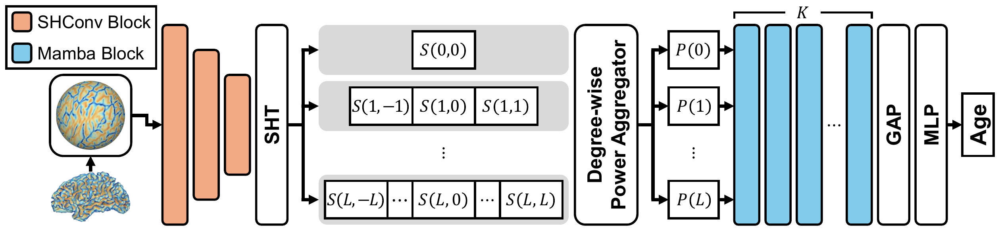

# SPHARM-Mamba: Rotation-Invariant Multiscale Modeling for Brain Age Prediction

Official preview for the MICCAI 2026 paper *SPHARM-Mamba: Rotation-Invariant Multiscale Modeling for Brain Age Prediction* in the `SPHARM-Mamba` repository.

The proposed method performs cortical surface-based brain age prediction using spherical harmonic representations and Mamba-based sequence modeling. It captures multiscale spectral patterns on cortical surfaces while preserving rotation-invariant properties.

  

## Description

Brain age prediction from cortical surfaces requires modeling both global cortical organization and local morphological variation. Existing surface-based deep learning methods often rely on local aggregation or patch-based tokenization. These designs can be sensitive to surface rotations and may require anatomical registration or extensive data augmentation.

SPHARM-Mamba addresses this limitation by representing cortical surface features in the spherical harmonic domain. Spherical harmonic convolution first extracts geometry-aware spectral features while preserving rotation-equivariant structure. The learned coefficients are then converted into rotation-invariant degree-wise descriptors through power aggregation within each harmonic degree.

The resulting descriptors form a natural coarse-to-fine sequence, where low harmonic degrees capture global shape patterns and high degrees represent increasingly localized cortical details. SPHARM-Mamba applies Mamba to this degree-ordered sequence to model cross-degree dependencies and integrate multiscale cortical information efficiently. This enables accurate and rotation-invariant brain age prediction without relying on patch partitioning or anatomical surface registration.

## Status

Code and pretrained resources are coming soon.
